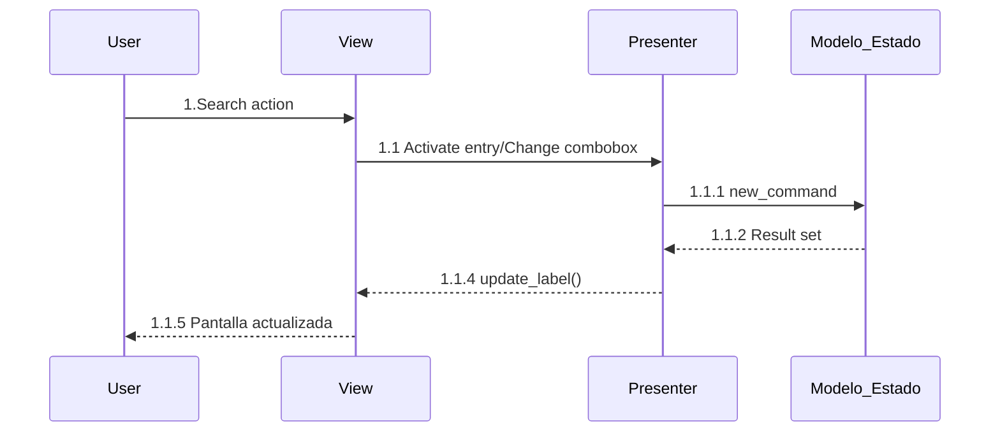
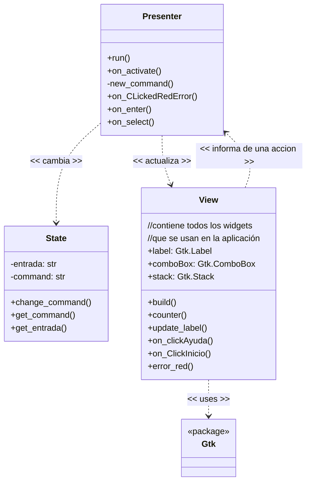

```mermaid
sequenceDiagram
    User->>View: 1.Search action
    View->>Presenter: 1.1 Activate entry/Change combobox
    Presenter->>Modelo_Estado:1.1.1 new_command
    Modelo_Estado-->>Presenter:1.1.2 Result set
    Presenter-->>View:1.1.4 update_label()
    View-->>User:1.1.5 Pantalla actualizada
```

```mermaid
classDiagram
    class State {
        -entrada: str 
        -command: str
        +change_command()
        +get_command()
        +get_entrada()

	}
    class Presenter{
        +run()
        +on_activate()
        -new_command()
        +on_CLickedRedError()
        +on_enter()
        +on_select()

    }
    View ..> Presenter : << informa de una accion >>
    Presenter ..> View : << actualiza >>
    Presenter ..> State : << cambia >>
	class View {
        //contiene todos los widgets
        //que se usan en la aplicación
        +label: Gtk.Label
        +comboBox: Gtk.ComboBox
        +stack: Gtk.Stack
        +build()
        +counter()
        +update_label()
        +on_clickAyuda()
        +on_ClickInicio()
        +error_red()
	}
	View ..> Gtk : << uses >>
	class Gtk
	<<package>> Gtk
```
